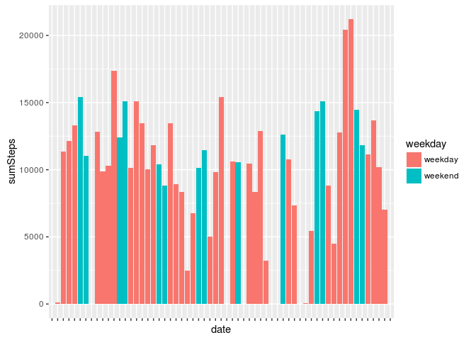
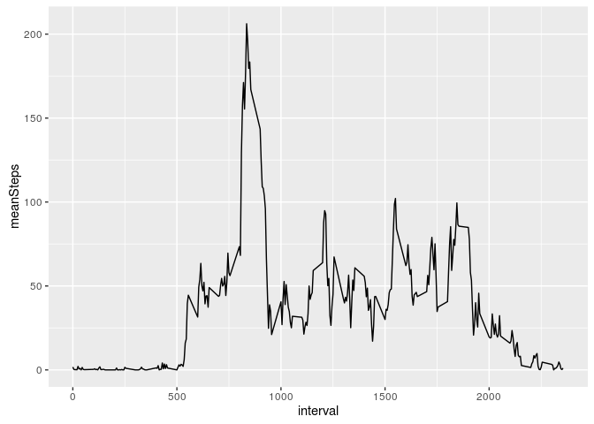
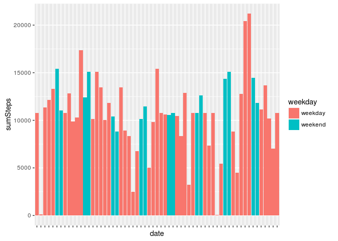
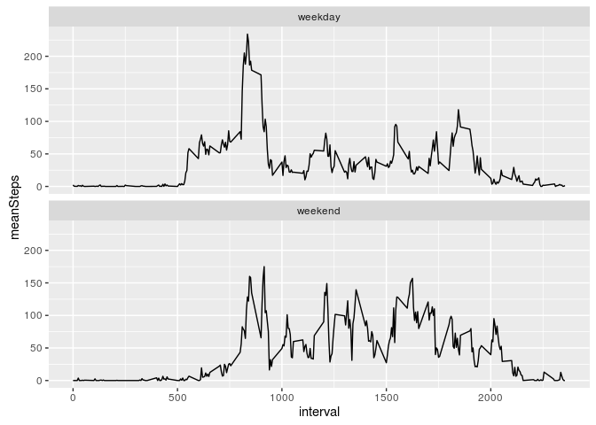

# Reproducible Research: Peer Assessment 1


## Loading and preprocessing the data

I'm used to work with dplyr and ggplot2, so I'm loading these libraries. 


```
## 
## Attaching package: 'dplyr'
```

```
## The following objects are masked from 'package:stats':
## 
##     filter, lag
```

```
## The following objects are masked from 'package:base':
## 
##     intersect, setdiff, setequal, union
```

The file "activity.zip" contains the data. This file is unzipped and then read into R. I'm already adding a weekday variable at this point. I'm creating the variables "local_saturday" and "local_sunday" because I'm living in Germany and the weekdays function will return "Samstag" and "Sonntag" when I run it on my computer. However, the code should work in any country.

Unfortunately, dplyr makes some prolems with POSIX dates (therefore, I'm not converting date to POSIX in the beginning.)


```r
local_saturday = weekdays(strptime("2016-06-11", format = "%Y-%m-%d"))
local_sunday = weekdays(strptime("2016-06-12", format = "%Y-%m-%d"))

unzip("activity.zip")

activity <- read.csv("activity.csv") %>%
  mutate(weekday = ifelse(weekdays(strptime(date, format = "%Y-%m-%d")) 
                          %in% c(local_saturday, local_sunday), 
                          "weekend", 
                          "weekday"))
```

## What is mean total number of steps taken per day?

Next, I'm calculating the total number of steps taken per day.


```r
steps_per_day <- 
  activity %>%
  group_by(date) %>%
  summarize(sumSteps = sum(steps), weekday = first(weekday))

ggplot(data = steps_per_day, aes(x = date, y = sumSteps)) + 
  geom_bar(aes(fill = weekday), stat = "identity") +
  scale_x_discrete(labels = NULL)
```

```
## Warning: Removed 8 rows containing missing values (position_stack).
```

<!-- -->

The mean and the median of the total number of steps per day is:


```r
mean(steps_per_day$sumSteps, na.rm = T)
```

```
## [1] 10766.19
```

```r
median(steps_per_day$sumSteps, na.rm = T)
```

```
## [1] 10765
```

## What is the average daily activity pattern?

Here is the average daily activity pattern:


```r
steps_per_interval <- 
  activity %>%
  group_by(interval) %>%
  summarize(meanSteps = mean(steps, na.rm = T))

ggplot(data = steps_per_interval, aes(x = interval, y = meanSteps)) +
  geom_line()
```

<!-- -->

On average, the interval with the maximum number of steps is:


```r
steps_per_interval$interval[which.max(steps_per_interval$meanSteps)]
```

```
## [1] 835
```

## Imputing missing values

The number of rows where the number of steps is NA is:


```r
sum(is.na(activity$steps))
```

```
## [1] 2304
```

I'm imputing missing values by using the average number of steps for a given interval for each interval where the number of steps is NA.


```r
activity2 <- 
  activity %>%
  group_by(interval) %>%
  mutate(interval_mean = mean(steps, na.rm = T),
         imputed_steps = ifelse(is.na(steps), interval_mean, steps)) 

steps_per_day2 <- 
  activity2 %>%
  group_by(date) %>%
  summarize(sumSteps = sum(imputed_steps), weekday = first(weekday))
```

Now, the histogram looks like this.


```r
ggplot(data = steps_per_day2, aes(x = date, y = sumSteps)) + 
  geom_bar(aes(fill = weekday), stat = "identity") +
  scale_x_discrete(labels = NULL)
```

<!-- -->

The mean and the median does not change much. The reason seems to be that the values are imputed from the averaged data anyway.


```r
mean(steps_per_day2$sumSteps, na.rm = T)
```

```
## [1] 10766.19
```

```r
median(steps_per_day2$sumSteps, na.rm = T)
```

```
## [1] 10766.19
```

## Are there differences in activity patterns between weekdays and weekends?

The activity seems to start a little bit later and there is no peak in the early morning.


```r
activity %>%
  group_by(weekday, interval) %>%
  summarize(meanSteps = mean(steps, na.rm = T)) %>%
  ggplot(aes(x = interval, y = meanSteps)) +
  geom_line() +
  facet_wrap(~ weekday, ncol = 1)
```

<!-- -->

